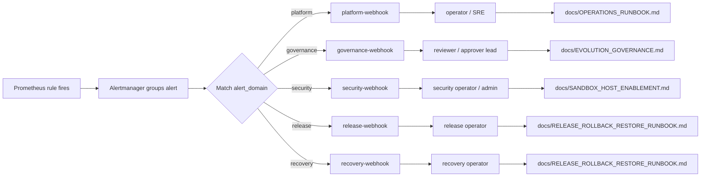

# Archillx Alertmanager Receivers & Owner Mapping

This note extends the alerting bundle with concrete receiver examples and an owner mapping table.

## Receiver examples

The starter Alertmanager configuration now includes these receiver names:

- `platform-webhook`
- `governance-webhook`
- `security-webhook`
- `release-webhook`
- `recovery-webhook`
- `warning-webhook`
- `critical-webhook`

Use them as placeholders and replace the example URLs with your real endpoints.

## Recommended owner mapping

| alert_domain | Primary owner | Typical alerts | Primary runbook |
| --- | --- | --- | --- |
| `platform` | operator / SRE | API health, readiness, 5xx spikes, metrics pipeline issues | `docs/OPERATIONS_RUNBOOK.md` |
| `governance` | reviewer / approver lead | governor blocked spikes, evolution pipeline anomalies | `docs/EVOLUTION_GOVERNANCE.md` |
| `security` | security operator / admin | sandbox failures, ACL anomalies, auth abuse, denied execution spikes | `docs/SANDBOX_HOST_ENABLEMENT.md` and `docs/OPERATIONS_RUNBOOK.md` |
| `release` | release operator | release gate failures, release check regressions | `docs/RELEASE_ROLLBACK_RESTORE_RUNBOOK.md` |
| `recovery` | recovery operator | rollback failures, restore drill failures, backup verification failures | `docs/RELEASE_ROLLBACK_RESTORE_RUNBOOK.md` |

## Severity handling guidance

| severity | Suggested handling |
| --- | --- |
| `warning` | route to chat / ticketing; observe trend before paging |
| `critical` | page operator / on-call; require incident note and evidence retention |

## Receiver routing pattern

Recommended order:

1. Route by `alert_domain`
2. Then fan out by `severity`
3. Use `inhibit_rules` so critical suppresses duplicate warnings

## Production checklist

- Replace all example receiver URLs
- Confirm `alert_domain` labels in `deploy/prometheus/alert_rules.yml`
- Confirm each owner has an explicit runbook
- Confirm release / recovery routes are tested before production rollout
- Confirm Alertmanager grouping uses `alertname`, `severity`, and `alert_domain`

## Example payload flow

The example webhook payload should be understood as a chain:

### Field-level interpretation

Use the payload fields in this order when consuming a webhook:

1. `commonLabels.alert_domain` → decides the receiver lane and owner
2. `commonLabels.severity` → decides escalation level
3. `commonLabels.alertname` → identifies the rule class
4. `commonAnnotations.summary` → operator-facing short reason
5. `commonAnnotations.runbook` → direct runbook pointer
6. `alerts[].startsAt` / `alerts[].fingerprint` → event identity and timing
7. `externalURL` / `generatorURL` → jump back to Alertmanager / Prometheus

### Minimal receiver decision map

| Payload field | Meaning | Receiver decision | Owner handoff |
| --- | --- | --- | --- |
| `alert_domain=platform` | runtime / API / readiness problem | `platform-webhook` | operator / SRE |
| `alert_domain=governance` | evolution / governor / policy anomaly | `governance-webhook` | reviewer / approver lead |
| `alert_domain=security` | sandbox / auth / ACL / deny anomaly | `security-webhook` | security operator / admin |
| `alert_domain=release` | release gate / rollout issue | `release-webhook` | release operator |
| `alert_domain=recovery` | rollback / restore / backup issue | `recovery-webhook` | recovery operator |

- `docs/ALERT_WEBHOOK_CONSUMER_TEMPLATE.md`

- `deploy/alertmanager/examples/fastapi_consumer.py`
- `deploy/alertmanager/examples/flask_consumer.py`

- `deploy/alertmanager/examples/common_payload.py`

- Alert webhook consumer test examples:
  - `deploy/alertmanager/examples/test_fastapi_consumer_example.py`
  - `deploy/alertmanager/examples/test_flask_consumer_example.py`
